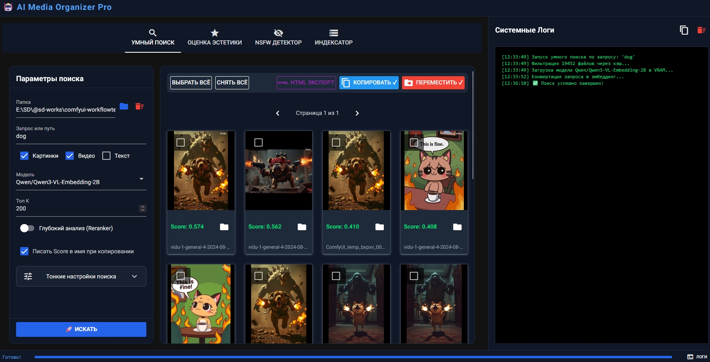

# 🧠 MediaMind AI (AI Media Organizer Pro)

**MediaMind AI** — это мощный локальный инструмент с веб-интерфейсом для умного поиска, оценки качества и сортировки огромных архивов фотографий и видео. Программа работает полностью на вашем ПК (офлайн) и использует передовые Vision-модели для анализа контента.

Вам больше не нужно помнить названия файлов или вручную разбирать гигабайты футажей. Просто напишите *"девушка в красном платье на фоне гор"* — и нейросеть найдет нужные кадры даже внутри видеороликов.



## ✨ Главные возможности

*   🔎 **Умный семантический поиск (Smart Search)**
    *   Поиск по смыслу с помощью современных моделей (например, `Qwen3-VL-Embedding`).
    *   Поддержка **глубокого анализа (Reranker)** для ювелирной точности результатов.
    *   Поиск работает не только по картинкам, но и **внутри видео** (покадровое извлечение).
*   ✨ **Оценка эстетики (Aesthetic Scoring)**
    *   Автоматически находит самые красивые и качественные кадры в ваших папках.
    *   Использует специально обученную модель `SigLIP Aesthetic Predictor V2.5`.
*   🚨 **NSFW Детектор**
    *   Надежная фильтрация взрослого или жестокого контента.
    *   Динамические фильтры: можно скрыть NSFW-контент из результатов поиска или, наоборот, отсортировать только его.
*   💾 **Экстремальная оптимизация памяти (Big Data Ready)**
    *   Многопоточное предкэширование (Индексатор) с сохранением признаков в быструю базу `SQLite`.
    *   **Блочная архитектура (Chunking)** и сжатие в RAM: программа способна переварить папки с 1 000 000+ файлов без вылетов по нехватке ОЗУ (OOM).
    *   Интеграция с **SageAttention** для ускорения инференса и экономии видеопамяти (VRAM).
    *   Поддержка квантования моделей (4-bit / 8-bit).
*   🛠 **Пакетная работа с файлами**
    *   Массовое копирование и перемещение найденных файлов.
    *   Возможность добавлять Score (оценку нейросети) в имя файла при копировании.
    *   Экспорт результатов в красивую автономную HTML-галерею.
*   💻 **Два режима работы**
    *   **Native Mode:** Открывается как обычное приложение с собственным окном.
    *   **Server Mode:** Запускается в фоне, доступно через браузер (можно заходить с телефона или ноутбука по локальной сети).

## 🚀 Установка и запуск (Windows)

Проект поставляется с умным портативным установщиком, который сам скачает нужную версию Python (через `uv`) и установит все зависимости в изолированную среду.

1. Склонируйте репозиторий:
   ```bash
   git clone https://github.com/ВАШ_НИК/mediamind-ai.git
   cd mediamind-ai
   ```
2. Запустите `run.bat`.
   * При первом запуске скрипт автоматически скачает портативный `uv`, Python 3.13 и все тяжелые ML-библиотеки (PyTorch, Transformers).
   * Скрипт создаст файл `.env`. Откройте его и впишите ваш токен HuggingFace (`HF_TOKEN=...`).
3. Запустите `run.bat` снова для старта десктопного приложения.

### Запуск в режиме сервера (Web UI)
Если вы хотите открыть приложение в браузере (или расшарить в локальную сеть), используйте скрипт:
```bash
run_server.bat
```
*Интерфейс будет доступен по адресу: `http://localhost:8080`*

## 🧩 Поддерживаемые форматы
* **Фото:** `.jpg`, `.jpeg`, `.png`, `.webp`, `.bmp`, `.tiff`
* **Видео:** `.mp4`, `.avi`, `.mov`, `.mkv`, `.webm`
* **Текст (для поиска):** `.txt`, `.md`, `.json`, `.csv`

## 🏗 Архитектура кэша (SQLite)
Чтобы не нагружать видеокарту при повторных запросах, программа один раз прогоняет файлы через нейросети и сохраняет "эмбеддинги" (числовые векторы) и оценки в локальную БД (`image_cache.db`).
При поиске или сортировке программа в первую очередь обращается к базе данных. Время отклика по уже проиндексированной базе составляет доли секунды.

## 📄 Лицензия
Распространяется под лицензией MIT. Подробности см. в файле [LICENSE](LICENSE).

---
*Сделано с ❤️ и силой ИИ.*
